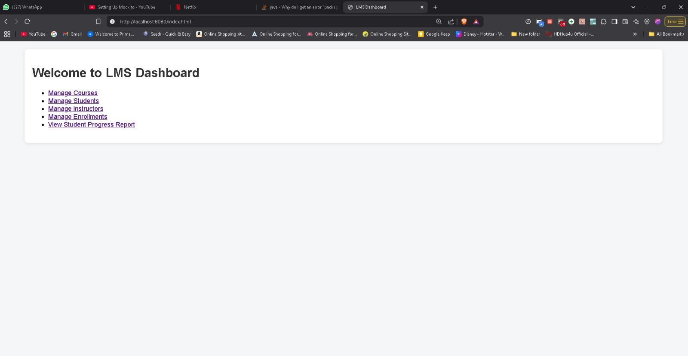
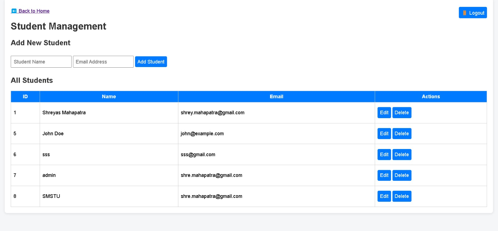
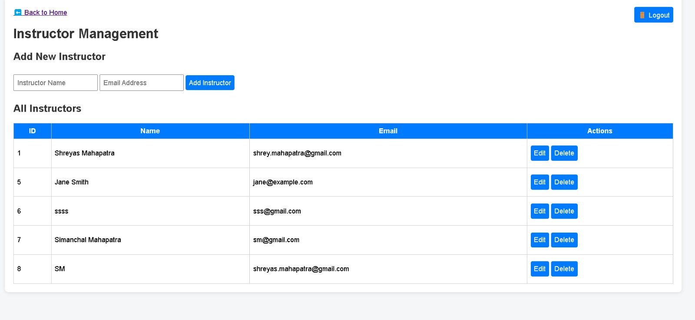
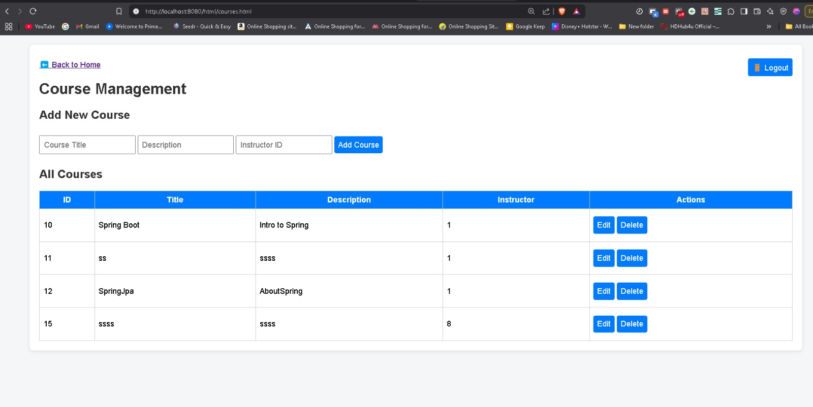
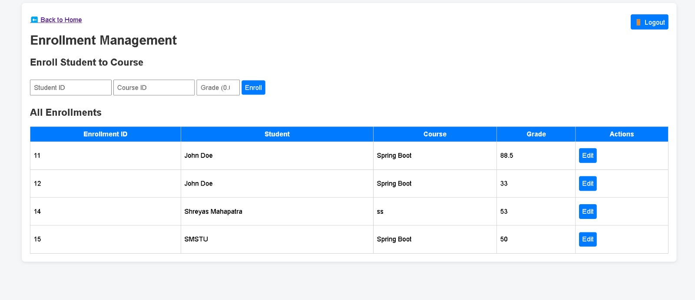
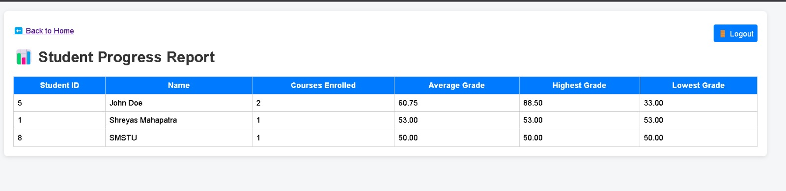

# 📚 LMS - Learning Management System

A web-based application built using **Spring Boot (Backend)** and **HTML/CSS/JavaScript (Frontend)** to manage students, instructors, courses, enrollments, and student performance reports.

---

## 🚀 Steps to Handle the Application

### ⚙️ Prerequisites
- Java 17
- MySQL running locally (or remote)
- IntelliJ IDEA or another Java IDE
- Maven installed

---

### ⚠️ Initial Setup

1. **Configure your MySQL credentials** in:
   `src/main/resources/application.properties`

```properties
spring.datasource.url=jdbc:mysql://localhost:3306/lmsdb
spring.datasource.username=YOUR_DB_USERNAME
spring.datasource.password=YOUR_DB_PASSWORD
```

2. **Create the database manually**:

```sql
CREATE DATABASE lmsdb;
```

---

### 🧪 Run the Project

#### Option 1: From IntelliJ IDEA
- Open the project
- Right-click on `LmsSystemApplication.java`
- Click `Run`

#### Option 2: Using Maven (Command Line)
```bash
mvn spring-boot:run
```

## 🔐 Login (Basic Auth)

When the Spring Boot app starts, open your browser and go to:

```
http://localhost:8080/index.html
```

> You will be prompted to log in using your credentials (e.g., `admin` / `admin123`).

---

## 🧭 Navigation & Features

### 📌 LMS Dashboard

From the homepage, you can navigate to:
- Manage Courses
- Manage Students
- Manage Instructors
- Manage Enrollments
- View Student Progress Report



---

### 👨‍🎓 Manage Students

Add, edit, and delete student records.



---

### 👩‍🏫 Manage Instructors

Add, update, and delete instructor data.



---

### 📘 Manage Courses

Add new courses and link them to instructors.



---

### 📝 Manage Enrollments

Assign students to courses with grades. Also supports grade updates.



---

### 📊 Student Progress Report

Shows summary report per student: total courses, average, max, and min grade.



---


### 🧪 Testing via Postman

🔹 Base URL: `http://localhost:8080/api`

You can perform this easily by importing the provided LMS postman json file into your postman!!

**Make sure to set headers**:
```
Content-Type: application/json
```

Then use:

#### Add Student
POST /students
```json
{
  "name": "John Doe",
  "email": "john@example.com"
}
```

#### Enroll Student
POST /enrollments
```json
{
  "student": { "id": 1 },
  "course": { "id": 2 },
  "grade": 87.5
}
```

#### Update Grade
PUT /enrollments/{id}
```json
{
  "grade": 91.0
}
```

#### Generate Report
GET /enrollments/progress


## ✅ Tech Stack

- **Backend:** Spring Boot
- **Frontend:** HTML, CSS, JavaScript
- **Database:** H2 (in-memory)
- **Security:** Spring Security with Basic Auth

---

## 📝 Author

Shreyas Mahapatra
